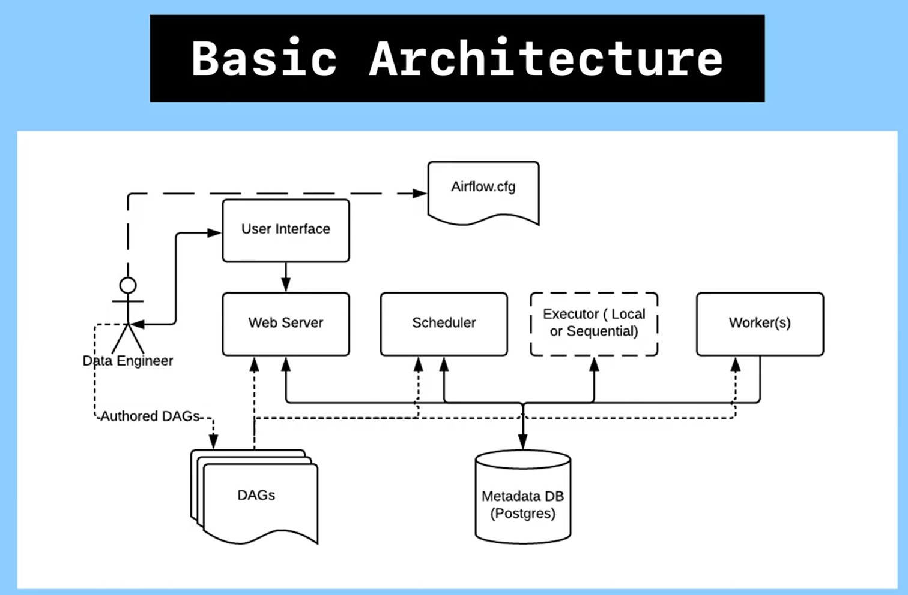

# Apache Airflow — Basic Architecture

## Overview

Apache Airflow is an open source platform to programmatically author, schedule and monitor workflows.

Apache Airflow is a tool that helps you create, organize, and keep track of your data tasks automatically. It's like a very smart to-do list for your data work that runs itself. 

Apache Airflow's architecture is composed of several interconnected components that work together to schedule, execute, and monitor workflows. This document walks through each component and how they interact.

---

## Components at a Glance

| Component | Type | Role |
|---|---|---|
| **Data Engineer** | Human actor | Authors and deploys DAGs |
| **DAGs** | Files | Python workflow definitions |
| **Web Server** | Service | Serves the UI, reads DAGs and DB |
| **User Interface** | Frontend | Dashboard for monitoring and control |
| **DAG File Processor** | Parser | Parses DAG files and serializes them into the metadata database|
| **API Server** | Endpoint | The API server provides endpoints for task operations and serving the UI|
| **Scheduler** | Service | Parses DAGs, triggers task instances |
| **Executor** | Plugin/Service | Determines *how* tasks are run |
| **Worker(s)** | Process(es) | Actually executes task code |
| **Queue** | Queue | The Queue is a list of tasks waiting to be executed|
| **Triggerer** | Triggerer | The Triggerer is responsible for managing deferrable tasks- tasks that wait for external events.|
| **Metadata DB (Postgres)** | Database | Source of truth for all state |
| **airflow.cfg** | Config file | Global configuration for all components |


---


---

## Component Deep Dives

### 👷 Data Engineer

The Data Engineer is the human entry point into the system. Their responsibilities are:

- **Authoring DAGs** — writing Python files that define workflows (tasks, dependencies, schedules).
- **Deploying DAGs** — placing DAG files into the DAGs folder where Airflow can pick them up.
- **Monitoring** — using the UI to check run statuses, trigger manual runs, and debug failures.

---

### 📂 DAGs (Directed Acyclic Graphs)

DAGs are Python files that define the structure of a workflow. They describe:

- **What tasks** need to run
- **In what order** (dependencies between tasks)
- **On what schedule** (e.g., daily, hourly, via cron expression)

DAGs are stored in a shared directory accessible to the Web Server, Scheduler, and Workers. They are **not executed directly** — they are parsed and used as blueprints.

```python
# Example DAG definition
from airflow import DAG
from airflow.operators.python import PythonOperator
from datetime import datetime

with DAG('my_pipeline', start_date=datetime(2024, 1, 1), schedule='@daily') as dag:
    task1 = PythonOperator(task_id='extract', python_callable=extract_fn)
    task2 = PythonOperator(task_id='transform', python_callable=transform_fn)
    task1 >> task2
```

---

### 🖥️ Web Server

The Web Server is a **Flask-based HTTP server** (Gunicorn in production) that:

- Reads DAG files to display pipeline structures
- Reads the Metadata DB to show task statuses, logs, and run history
- Allows users to trigger DAGs, clear task states, and configure variables/connections
- Sends responses back to the Data Engineer via the **User Interface**

> The Web Server is **read-heavy** — it queries the DB frequently but does not execute tasks itself.

---

### 🖱️ User Interface

The UI is the visual dashboard served by the Web Server. Key features include:

- **DAG list view** — see all pipelines and their health
- **Graph view** — visualize task dependencies
- **Gantt view** — analyze task timing and bottlenecks
- **Log viewer** — inspect task logs for debugging
- **Trigger runs** — manually kick off DAG runs

---

### ⏰ Scheduler

The Scheduler is the **heart of Airflow**. It runs as a persistent background process and:

1. **Parses DAG files** continuously to detect new or updated pipelines
2. **Evaluates schedules** — determines which DAG runs are due
3. **Checks task dependencies** — ensures upstream tasks have succeeded before scheduling downstream ones
4. **Creates task instances** — writes them to the Metadata DB with a `Scheduled` state
5. **Submits tasks to the Executor** for execution

The Scheduler reads from and writes to the **Metadata DB** constantly, making the DB a critical dependency.

---

### ⚙️ Executor (Local or Sequential)

The Executor is a **pluggable component** that defines *how* tasks are dispatched to workers. The diagram highlights two basic executor types:

| Executor | Description | Use Case |
|---|---|---|
| **Sequential Executor** | Runs one task at a time, in the same process as the Scheduler | Development/testing only |
| **Local Executor** | Runs tasks as subprocesses on the same machine as the Scheduler | Single-machine production setups |
| **Celery Executor** *(not shown)* | Distributes tasks across multiple remote workers via a message queue | Scalable, distributed production |
| **Kubernetes Executor** *(not shown)* | Spins up a new Pod per task | Cloud-native, highly scalable |

The Executor reads task assignments from the Metadata DB and hands them off to available **Workers**.

---

### 🔧 Worker(s)

Workers are the processes that **actually execute the task code**. Each worker:

1. Picks up a task instance assigned by the Executor
2. Runs the Python callable, Bash script, SQL query, or any operator logic
3. Updates task state (Success, Failed, etc.) back in the **Metadata DB**
4. Writes logs for the UI to display

In the **Local Executor**, workers are subprocesses on the same machine. In **Celery/Kubernetes**, they are separate machines or containers.

---

### 🗄️ Metadata DB (Postgres)

The Metadata DB is the **single source of truth** for the entire Airflow system. It stores:

- All DAG definitions and run history
- Task instance states (Scheduled, Running, Success, Failed, etc.)
- Connections, Variables, and XComs (cross-task communication)
- User accounts and RBAC permissions (if enabled)

Every major component — the Scheduler, Web Server, Executor, and Workers — reads from and writes to this database.

> **PostgreSQL** is the recommended production database. SQLite is supported for development only.

---

### 🔧 airflow.cfg

`airflow.cfg` is the **global configuration file** for the entire Airflow installation. It controls settings such as:

- Which **Executor** to use (`executor = LocalExecutor`)
- Database **connection string** (`sql_alchemy_conn = postgresql+psycopg2://...`)
- DAGs folder path
- Scheduler heartbeat interval
- Web Server port and workers
- Logging backend

All components read from this file at startup. It can also be overridden using **environment variables** (prefixed with `AIRFLOW__SECTION__KEY`).

---

## Data Flow Summary

```
Data Engineer
    │
    ├── Authors ──────────────────► DAG Files
    │                                   │
    │                                   ├──► Web Server ──► User Interface ──► Data Engineer (view)
    │                                   ├──► Scheduler ──► Metadata DB
    │                                   └──► Worker(s) (task execution)
    │
    └── Interacts via ────────────► User Interface
                                        │
                                        └──► Web Server ──► Metadata DB (reads state)

Scheduler ◄──► Metadata DB ◄──► Executor ◄──► Worker(s)
                    ▲
              Web Server reads
```

---

## Component Interaction Table

| From | To | Type of Interaction |
|---|---|---|
| Data Engineer | DAGs folder | Writes DAG Python files |
| Data Engineer | User Interface | Triggers runs, monitors status |
| User Interface | Web Server | HTTP requests |
| Web Server | DAGs folder | Reads DAG structure for display |
| Web Server | Metadata DB | Reads task/run state |
| Scheduler | DAGs folder | Parses DAG files continuously |
| Scheduler | Metadata DB | Writes task instances & reads state |
| Executor | Metadata DB | Reads scheduled tasks, updates state |
| Executor | Worker(s) | Dispatches task execution |
| Worker(s) | Metadata DB | Writes task results and state |
| All components | airflow.cfg | Reads configuration at startup |

---

## Architecture Limitations (Basic Mode)

This **basic architecture** (Local/Sequential Executor) has some constraints:

- **Single machine** — Scheduler, Executor, and Workers all run on one host
- **Limited parallelism** — Sequential Executor runs only one task at a time
- **No fault tolerance** — if the machine goes down, everything stops
- **Not horizontally scalable** — can't add more worker machines

For production at scale, teams typically upgrade to **Celery Executor** (with Redis/RabbitMQ) or **Kubernetes Executor** to distribute work across multiple nodes.

---

*This document is based on the Apache Airflow Basic Architecture diagram.*
