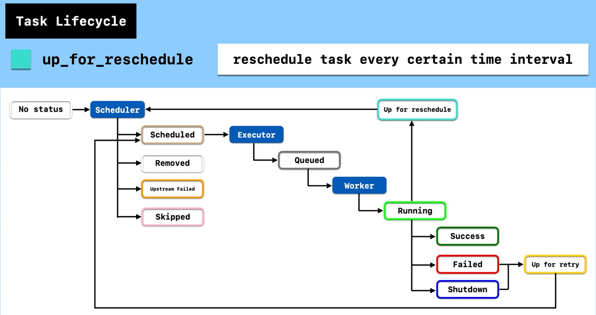
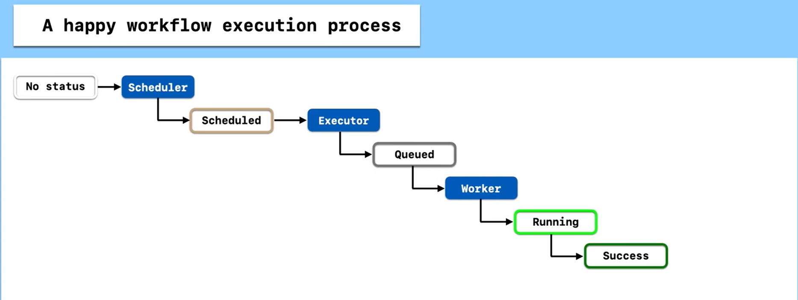

# Apache Airflow Task Lifecycle

## Overview

This document explains the **Apache Airflow Task Lifecycle** as illustrated in the diagram, with a focus on the `up_for_reschedule` state — which triggers a task to be **rescheduled at regular time intervals**.

---

## Key Actors

| Actor | Role |
|---|---|
| **Scheduler** | The central coordinator that decides when and how tasks are dispatched |
| **Executor** | Receives scheduled tasks and routes them to workers |
| **Worker** | The process that actually runs the task code |



---

## Task States

### Entry Point

- **No Status** → A task with no state yet is handed off to the **Scheduler** to begin its lifecycle.

---

### Scheduler-Assigned States

The Scheduler evaluates the task and places it into one of the following states:

| State | Description |
|---|---|
| **Scheduled** | Task is ready and queued for the Executor |
| **Removed** | Task has been removed from the DAG since the run was created |
| **Upstream Failed** | One or more upstream (dependency) tasks failed, so this task is skipped |
| **Skipped** | Task was intentionally skipped (e.g., via branching logic) |

---

### Execution Flow

Once a task is in the **Scheduled** state, it proceeds through the execution pipeline:

```
Scheduled → Executor → Queued → Worker → Running
```

1. **Scheduled** — Scheduler confirms task is ready to run.
2. **Executor** — Picks up the task and assigns it to an available worker queue.
3. **Queued** — Task is waiting in the worker pool queue.
4. **Worker** — A worker process picks up the task.
5. **Running** — Task is actively executing.

---

### Terminal States (from Running)

Once a task is **Running**, it will resolve to one of these terminal states:

| State | Color | Description |
|---|---|---|
| **Success** | Dark Green | Task completed successfully |
| **Failed** | Red | Task raised an error or exception |
| **Shutdown** | Dark Blue | Task was externally killed or interrupted |

---

### Retry States

- **Failed** → **Up for Retry** (Yellow): If the task is configured with `retries > 0`, it enters the `up_for_retry` state before being sent back to the Scheduler for another attempt.

- **Shutdown** → **Up for Retry**: A shutdown task may also trigger a retry depending on configuration.

---

## ⭐ Special State: `up_for_reschedule`

```
Running → Up for reschedule → Scheduler (loop)
```

### What is it?

`up_for_reschedule` is a special state used by **Sensor tasks** (tasks that wait for an external condition to be met). Instead of occupying a worker slot the entire time while polling, the task:

1. **Runs briefly** to check the condition.
2. **Releases the worker slot** and enters `up_for_reschedule`.
3. **Returns to the Scheduler**, which re-queues it after a defined time interval.
4. This loop repeats until the condition is met (→ `Success`) or a timeout occurs (→ `Failed`).

### Why is it useful?

| Without `up_for_reschedule` | With `up_for_reschedule` |
|---|---|
| Sensor occupies a worker slot the entire wait time | Worker slot is freed between checks |
| Can starve other tasks of resources | Resource-efficient, scales better |
| `mode='poke'` (default Sensor mode) | `mode='reschedule'` Sensor mode |

### How to enable it

In your Sensor operator, set `mode='reschedule'`:

```python
from airflow.sensors.filesystem import FileSensor

wait_for_file = FileSensor(
    task_id='wait_for_file',
    filepath='/data/input/myfile.csv',
    mode='reschedule',        # ← enables up_for_reschedule state
    poke_interval=60,         # check every 60 seconds
    timeout=3600,             # fail after 1 hour
    dag=dag,
)
```

---

## Full State Transition Summary

```
No Status
    └─► Scheduler
            ├─► Scheduled ──► Executor ──► Queued ──► Worker ──► Running
            │                                                        ├─► Success
            │                                                        ├─► Failed ──► Up for retry ──► Scheduler (retry loop)
            │                                                        ├─► Shutdown ──► Up for retry ──► Scheduler (retry loop)
            │                                                        └─► Up for reschedule ──► Scheduler (reschedule loop)
            ├─► Removed
            ├─► Upstream Failed
            └─► Skipped
```

---

## Key Differences: Retry vs Reschedule

| | `up_for_retry` | `up_for_reschedule` |
|---|---|---|
| **Triggered by** | Task failure | Sensor condition not yet met |
| **Purpose** | Re-attempt a failed task | Periodically re-check an external condition |
| **Configured via** | `retries` parameter | `mode='reschedule'` on Sensor |
| **Resource impact** | Frees worker between attempts | Frees worker between checks |

---




*This document is based on the Apache Airflow Task Lifecycle diagram illustrating scheduler, executor, and worker interactions.*
